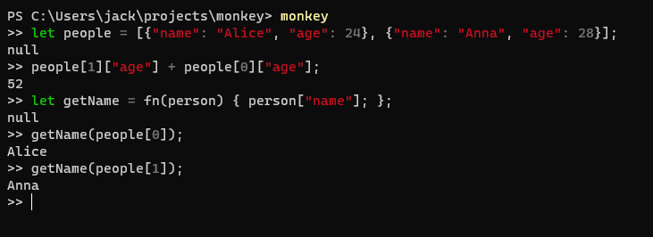

# Monkey

## Install

    pipenv install -e .

    pipenv run monkey

## Tests

    pipenv install --dev .

    pipenv run pytest

## Example

    $ monkey

    >> let map = fn(arr, f){ let iter = fn(arr, accumulated) { if(len(arr)==0) { accumulated } else {iter(rest(arr), push(accumulated, f(first(arr)))); } }; iter(arr,[]); };
    null
    >> let a = [1,2,3,4];
    null
    >> let double = fn(x) { x * 2 } ;
    null
    >> map(a, double);
    [2, 4, 6, 8]